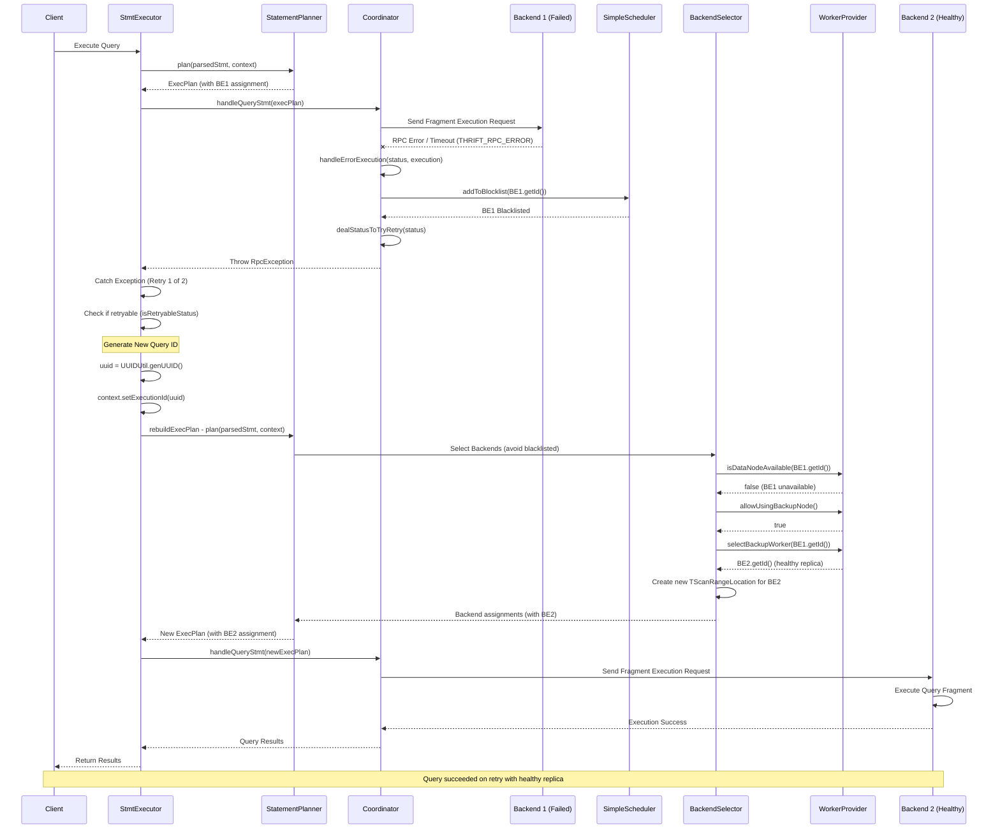
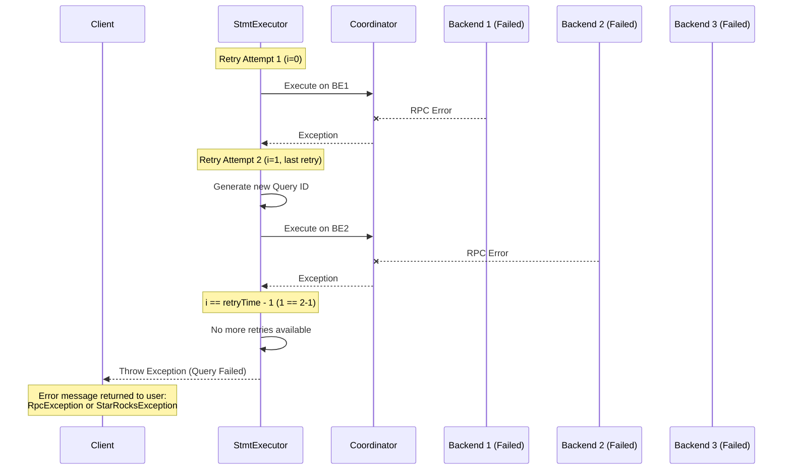

# StarRocks BE Failure Retry Mechanism - Sequence Diagram



## Flow Explanation

### Phase 1: Initial Execution & Failure (Lines 1-15)
1. Client sends query to StmtExecutor
2. StatementPlanner creates execution plan assigning work to BE1
3. Coordinator sends fragment to BE1
4. BE1 fails (network error, crash, timeout)

### Phase 2: Failure Detection & Blacklisting (Lines 17-25)
5. Coordinator detects RPC error (THRIFT_RPC_ERROR)
6. Coordinator calls handleErrorExecution()
7. Failed BE1 is added to blacklist via SimpleScheduler
8. Exception propagates back to StmtExecutor

### Phase 3: Retry Decision & Plan Rebuild (Lines 27-45)
9. StmtExecutor catches exception and checks if retryable
10. Generates new Query ID for retry attempt
11. Rebuilds execution plan via StatementPlanner
12. BackendSelector checks if BE1 is available (it's not)
13. Looks for backup node with healthy replica
14. WorkerProvider selects BE2 (has healthy replica of tablet)
15. Creates new scan range location pointing to BE2

### Phase 4: Re-execution on Healthy Backend (Lines 47-54)
16. New execution plan with BE2 assignment is created
17. Coordinator sends fragment to BE2
18. BE2 successfully executes the query
19. Results are returned to client

## Key Points

- **Query-level retry**: Entire query is retried, not individual fragments
- **Blacklisting**: Failed BEs are temporarily blocked to prevent repeated failures
- **Plan regeneration**: Each retry creates a fresh execution plan
- **Replica failover**: System automatically finds healthy replicas on other BEs
- **Configurable retries**: Default is 2 retry attempts (`max_query_retry_time`)

---

## What Happens When Max Retries Exceeded?

When the query fails after exhausting all retry attempts (`max_query_retry_time`), the system handles it as follows:

### Code Logic (`StmtExecutor.java:762-763`)
```java
if (i == retryTime - 1 || context instanceof ArrowFlightSqlConnectContext) {
    throw e;  // Throw the exception to client
}
```

### Failure Scenario Flow



### What Gets Returned to Client

1. **Exception Type**: The original exception is thrown:
   - `RpcException` - for BE communication failures
   - `StarRocksException` - for internal errors
   - `RemoteFileNotFoundException` - for external table file issues

2. **Error Message**: Contains details like:
   ```
   Query cancelled by crash of backends or RpcException
   QueryId: xxx
   Backend: xxx is down
   ```

3. **Log Entry** (`StmtExecutor.java:774`):
   ```
   LOG.warn("retry {} times. stmt: {}", (i + 1), originStmt);
   ```
   Shows how many retry attempts were made

4. **Profile Cleanup**: Failed query profiles are removed from ProfileManager to avoid clutter

### Special Cases Where Retry is Skipped

1. **ArrowFlightSqlConnectContext** (`StmtExecutor.java:762`):
   - No retry for Arrow Flight SQL connections
   - Reason: FE cannot determine if client has already pulled data from BE

2. **Data Already Sent to Client** (`StmtExecutor.java:776-777`):
   ```java
   if (!context.getMysqlChannel().isSend()) {
       needRetry = true;  // Safe to retry
   } else {
       throw e;  // Data already sent, cannot retry
   }
   ```
   - If MySQL channel has already sent data to client, retry is unsafe
   - Immediate exception thrown to avoid duplicate/inconsistent results

### Configuration

**File**: `fe/fe-core/src/main/java/com/starrocks/common/Config.java:1549`
```java
public static int max_query_retry_time = 2;
```

To change retry behavior, modify this configuration:
- Set to `1`: No retries (immediate failure)
- Set to `2` (default): 1 retry attempt
- Set to `3`: 2 retry attempts
- Maximum recommended: `3-5` (to avoid excessive delays)

### Summary: Max Retry Exceeded Behavior

| Scenario | Action | Result |
|----------|--------|--------|
| All retries exhausted | Throw exception to client | Query fails with error message |
| Arrow Flight SQL context | No retry, immediate exception | Query fails on first error |
| Data already sent to client | No retry, immediate exception | Query fails to prevent inconsistent results |
| Retry limit not reached | Rebuild plan & retry | Query continues with new BE assignment |

## Related Files

- `fe/fe-core/src/main/java/com/starrocks/qe/StmtExecutor.java:742-777` - Main retry loop
- `fe/fe-core/src/main/java/com/starrocks/qe/DefaultCoordinator.java:749-771` - Failure detection
- `fe/fe-core/src/main/java/com/starrocks/qe/ExecuteExceptionHandler.java:56-68` - Exception handling
- `fe/fe-core/src/main/java/com/starrocks/qe/NormalBackendSelector.java:80-118` - Backup node selection
- `fe/fe-core/src/main/java/com/starrocks/common/Config.java:1549` - Retry configuration
```
